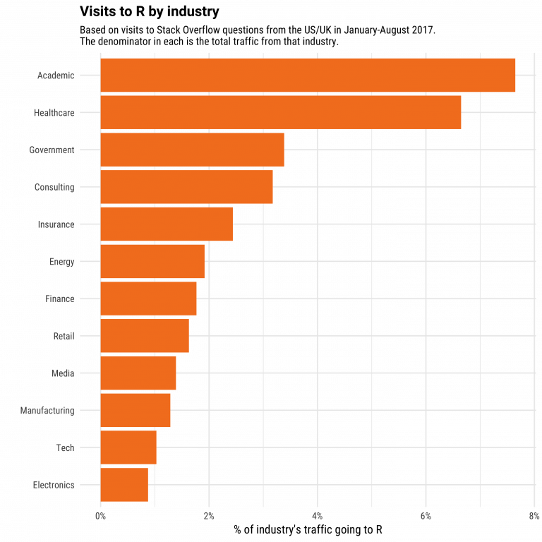
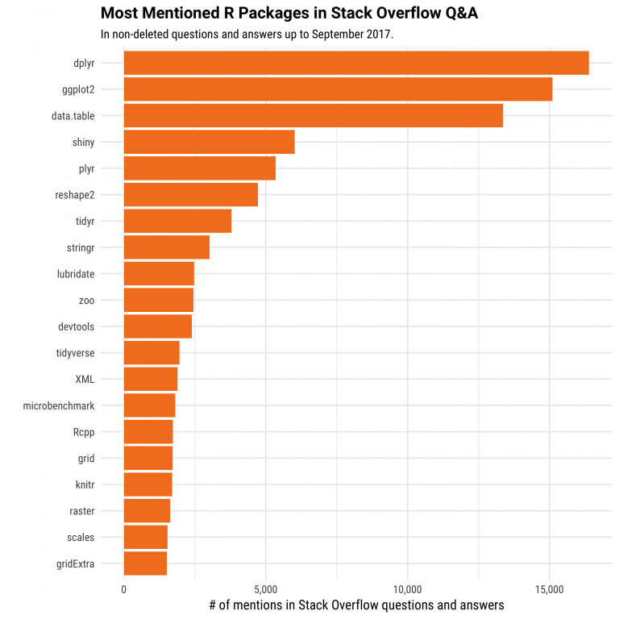
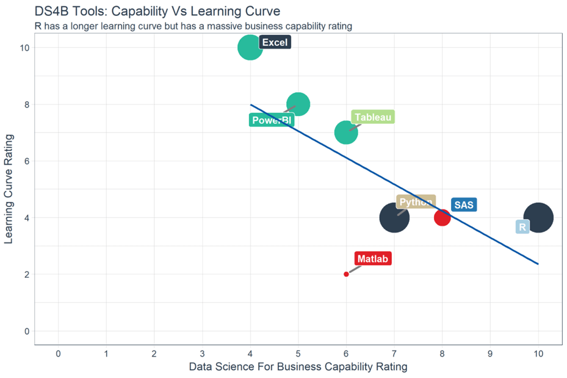
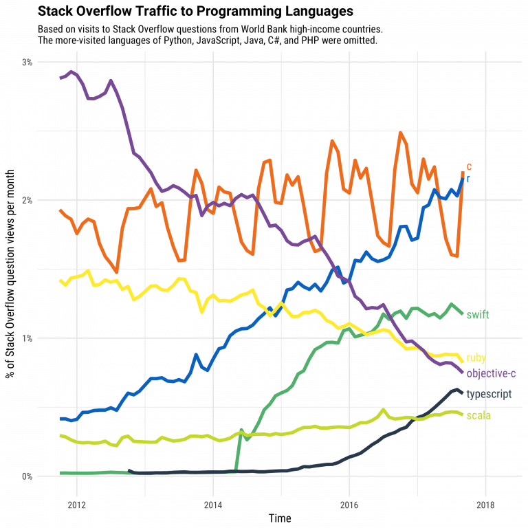

```{r setup, include=FALSE}
knitr::opts_chunk$set(
  echo = TRUE,
  fig.align = "center",
  message = FALSE,
  warning = FALSE
)
```

<br>

# What is R?
***
R is a programming language created by Ross Ihaka and Robert Gentleman in 1993. R offers a large ecosystem of statistical and graphical methods, including machine learning, linear regression, time series analysis, and statistical inference, to name just a few.

Most R packages are written in R, but for computationally intensive tasks, performance-critical code is often written in C, C++, or Fortran.

R is widely used in academia, and it is also used by many large companies, such as Uber, Google, Airbnb, and Facebook.

Data analysis in R is often done through a sequence of steps: programming, transforming data, exploring patterns, modeling, and communicating results.

+ __Program__: R is a clear and accessible programming tool.
+ __Transform__: R provides a collection of libraries designed specifically for data science.
+ __Discover__: Explore the data, refine your hypotheses, and analyze the results.
+ __Model__: R offers a wide range of tools to build appropriate models for your data.
+ __Communicate__: Combine code, graphs, and outputs into reports with R Markdown, or build Shiny apps to share your work.

# What is R used for?
***

+ Statistical inference
+ Data analysis
+ Machine learning

# R by industry
***
If we break down the use of R by industry, academia usually comes first. R is a language designed for statistics. It is also widely used in healthcare, followed by government and consulting.

<p align="center">

</p>

# R packages
***
The primary uses of R are, and will continue to be, statistics, visualization, and machine learning. The figure below shows which R packages receive the most questions on Stack Overflow. Among the top 10, many are related to a data scientist’s workflow: data preparation and communicating results.

<p align="center">

</p>

Most R packages (almost 12,000) are available on CRAN (the Comprehensive R Archive Network), which is free and open source. You can download and use these packages for tasks such as machine learning and time series analysis.

<p align="center">

</p>

# Communicate with R
***
R provides multiple ways to present and share your work, for example through R Markdown documents or Shiny apps. Content can be hosted on RPubs, GitHub Pages, or a company website.

Below is an example of a presentation hosted on [RPubs](https://rpubs.com/).

RStudio supports R Markdown to write documents and export them in different formats:

* Documents:
  + HTML
  + PDF (LaTeX)
* Presentations:
  + HTML
  + PDF (Beamer)

# Why use R?
***
Data science is shaping how companies run their businesses. The key question is: which tool or programming language should you use?

There are many tools available for data analysis, and learning a new language requires time. The figure below compares the learning curve of different tools with the business value they can provide. This trade-off suggests there is no “free lunch”: to get better insights from data, you need to invest time in learning a capable tool such as R.

<p align="center">

</p>

In the top-left of the chart, you can see Excel and Power BI. These tools are easy to learn but can be limited for advanced modeling. In the middle, you can see Python and SAS. SAS is a dedicated platform for business statistics, but it is not free and is often used as “click-and-run” software. Python is excellent for deploying machine learning and AI, but it often requires additional tools for reporting and communication.

With a similar learning curve, R can be a strong trade-off between data analysis, modeling, and communication.

For data visualization, you may have heard about Tableau. Tableau is a powerful tool for exploring patterns through charts and dashboards, and it is relatively quick to learn. However, visualization alone may not lead to actionable insights: it is easy to create many charts without reaching a clear conclusion. Tableau is great for quick exploration and business intelligence, while R is often more suitable for statistics-driven decision making.

Stack Overflow is a large community for programmers. If you have a coding issue or need help understanding a method, Stack Overflow is often useful. Over the years, views of R-related questions have increased sharply, reflecting the growth of data science and the demand for R skills.

<p align="center">

</p>

In data science, the two most widely used programming languages are R and Python.

# Should you choose R?
***
Data scientists often use two excellent tools: R and Python. You may not have time to learn both, especially when starting out. Learning statistics and modeling concepts is often more important than learning a specific programming language.

A programming language is a tool to compute results and communicate findings. In practice, one of the most important parts of data science is the data workflow: importing data, cleaning it, preparing it, performing feature engineering, and selecting variables. This should be a primary focus.

Trying to learn R and Python at the same time without a solid statistical foundation is usually not effective. Data scientists are not “just programmers”: the goal is to understand data, manipulate it, and choose appropriate methods.

Because data science is often used by business professionals, communication is essential. You may need to produce reports, web apps, or dashboards. A tool that integrates analysis and communication can be a strong advantage.

# Is R difficult?
***
Years ago, R was harder to master. Some workflows were less consistent compared to other tools. To address this, Hadley Wickham developed the tidyverse, a collection of packages that made data manipulation more intuitive and consistent. As a result, many data tasks became easier, and creating good graphs became more accessible.

Many machine learning methods can be implemented in R. Packages such as Keras and TensorFlow provide access to modern deep learning workflows. R also supports xgboost, one of the most widely used algorithms in Kaggle competitions.

R can also interact with other languages. It is possible to call Python, Java, or C++ from R. Big-data tools are also accessible: you can connect R to systems such as Spark or Hadoop, and to many databases.

Finally, R has evolved to support parallel computing. In the past, R was criticized for using only one CPU core at a time. Packages such as parallel can help you run tasks on multiple cores to speed up computation.

# Summary
***
In a nutshell, R is a powerful tool to explore and analyze data. Advanced tasks such as clustering, correlation analysis, and dimensionality reduction can be done in R. This is often a crucial step: without good feature engineering and solid modeling, deploying machine learning will not produce meaningful results.

# Download R
***
Go to <https://cran.r-project.org>. Precompiled binary distributions of R and contributed packages are available. Windows and macOS users will most likely want one of these versions:

* [Download R for Linux](https://cran.r-project.org/bin/linux/)
* [Download R for macOS](https://cran.r-project.org/bin/macosx/)
* [Download R for Windows](https://cran.r-project.org/bin/windows/)

# What is RStudio?
***
RStudio is an integrated development environment (IDE) for R. It includes a console, a syntax-highlighting editor that supports interactive code execution, and tools for plotting, history, debugging, and workspace management.

RStudio is available in open-source and commercial editions. It runs on the desktop (Windows, macOS, and Linux) or in a browser via RStudio Server / RStudio Server Pro.

# Download RStudio
***
Go to <https://posit.co/download/rstudio-desktop/>. Download the installer for your operating system, then double-click the downloaded file to begin the installation (`.dmg` on macOS and `.exe` on Windows) and follow the prompts.
