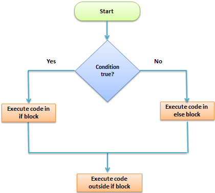

```{r setup, include=FALSE}
knitr::opts_chunk$set(
  echo = TRUE,
  fig.align = "center",
  message = FALSE,
  warning = FALSE
)
```

# The if / else statement {#buttons .tabset .tabset-fade .tabset-pills}

Conditional statements let you run different code depending on whether a condition is `TRUE` or `FALSE`. The basic syntax in R is: [web:749]

```{r, eval=FALSE}
if (condition) {
  expr1
} else {
  expr2
}
```

<p align="center">

</p>

## Example 1: Simple condition

```{r}
quantity <- 25

if (quantity > 20) {
  print("You sold a lot!")
} else {
  print("Not enough for today.")
}
```

Tip: consistent indentation matters a lot for readability.

# The else if statement

Use `else if` to check multiple conditions in sequence. [web:749]

```{r, eval=FALSE}
if (condition1) {
  expr1
} else if (condition2) {
  expr2
} else {
  expr3
}
```

## Example 2: Multiple conditions

```{r}
quantity <- 10

if (quantity < 20) {
  print("Not enough for today.")
} else if (quantity > 20 && quantity <= 30) {
  print("Average day.")
} else {
  print("What a great day!")
}
```

Note:
- `&&` is the scalar “AND” operator typically used in `if()` statements; `&` is vectorized and compares element-by-element. [web:755]

# Example: VAT rate by product category

Imagine three product categories with different VAT rates:

```{r, echo=FALSE}
library(knitr)

dt <- data.frame(
  Category = c("A", "B", "C"),
  Products = c(
    "Books, magazines, newspapers, ...",
    "Vegetables, meat, beverages, ...",
    "T-shirts, jeans, pants, ..."
  ),
  VAT = c("8%", "10%", "20%")
)

k <- knitr::kable(dt)

if (requireNamespace("kableExtra", quietly = TRUE)) {
  k <- kableExtra::kable_styling(k, bootstrap_options = c("striped", "hover"))
}

k
```

We can apply the correct VAT rate with an `if / else if` chain:

```{r}
category <- "A"
price <- 10

if (category == "A") {
  total <- price * 1.08
  cat("VAT rate: 8%.\nTotal price:", total, "\n")
} else if (category == "B") {
  total <- price * 1.10
  cat("VAT rate: 10%.\nTotal price:", total, "\n")
} else {
  total <- price * 1.20
  cat("VAT rate: 20%.\nTotal price:", total, "\n")
}
```

# Extra (optional): vectorized if-else

If you need to apply conditions to an entire vector (not just a single value), you typically use `ifelse()` (base R) or `dplyr::if_else()` (type-stable). [web:753][web:763]

```{r, eval=FALSE}
x <- c(10, 25, 40)
ifelse(x > 20, "big", "small")
```
