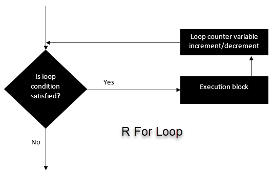

```{r setup, include=FALSE}
knitr::opts_chunk$set(echo = TRUE, fig.align="center")
```
# For Loop Syntax and Examples {#buttons .tabset .tabset-fade .tabset-pills}
***
```{r, dont-eval, eval=FALSE}
for (i in vector) {
    Exp	
}
```

Here, R will loop over all the variables in vector and do the computation written inside the exp.

<p align="center">

</p>

Let's see a few examples.

## Example 1: 
We iterate over all the elements of a vector and print the current value.
```{r}
# Create fruit vector
fruit <- c('Apple', 'Orange', 'Passion fruit', 'Banana')
# Create the for statement
for ( i in fruit){ 
 print(i)
}
```

## Example 2: 
creates a non-linear function by using the polynomial of x between 1 and 4 and we store it in a list
```{r}
# Create an empty list
list <- c()
# Create a for statement to populate the list
for (i in seq(1, 4, by=1)) {
  list[[i]] <- i*i
}
print(list)
```

The for loop is very valuable for machine learning tasks. After we have trained a model, we need to regularize the model to avoid over-fitting. Regularization is a very tedious task because we need to find the value that minimizes the loss function. To help us detect those values, we can make use of a for loop to iterate over a range of values and define the best candidate.

# For Loop over a list
***
Looping over a list is just as easy and convenient as looping over a vector. Let's see an example
```{r}
# Create a list with three vectors
fruit <- list(Basket = c('Apple', 'Orange', 'Passion fruit', 'Banana'), 
Money = c(10, 12, 15), purchase = FALSE)
for (p  in fruit) 
{ 
	print(p)
}
```

# For Loop over a matrix
A matrix has 2-dimension, rows and columns. To iterate over a matrix, we have to define two for loop, namely one for the rows and another for the column.
```{r}
# Create a matrix
mat <- matrix(data = seq(10, 20, by=1), nrow = 6, ncol =2)
# Create the loop with r and c to iterate over the matrix
for (r in 1:nrow(mat))   
    for (c in 1:ncol(mat))  
         print(paste("Row", r, "and column",c, "have values of", mat[r,c]))  
```


