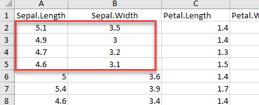

```{r setup, include=FALSE}
knitr::opts_chunk$set(echo = TRUE, fig.align="center")
```

# Read CSV
One of the most widely data store is the .csv (comma-separated values) file formats. R loads an array of libraries during the start-up, including the utils package. This package is convenient to open csv files combined with the reading.csv() function. Here is the syntax for read.csv

```{r, dont-eval, eval=FALSE}
read.csv(file, header = TRUE, sep = ",")
```

Argument:

- file: PATH where the file is stored
- header: confirm if the file has a header or not, by default, the header is set to TRUE
- sep: the symbol used to split the variable. By default, `,`.

We will read the data file name mtcats. The csv file is stored online. If your .csv file is stored locally, you can replace the PATH inside the code snippet. Don't forget to wrap it inside ' '. The PATH needs to be a string value.

For mac user, the path for the download folder is:

`"/Users/USERNAME/Downloads/FILENAME.csv"`

For windows user:

`"C:\Users\USERNAME\Downloads\FILENAME.csv"`

Note that, we should always specify the extension of the file name.

- .csv
- .xlsx
- .txt
- …

```{r}
PATH <- 'https://raw.githubusercontent.com/guru99-edu/R-Programming/master/mtcars.csv'                
df <- read.csv(PATH, header =  TRUE, sep = ',')
length(df)
class(df$X)
```

R, by default, returns character values as Factor. We can turn off this setting by adding stringsAsFactors = FALSE.

```{r}
PATH <- 'https://raw.githubusercontent.com/guru99-edu/R-Programming/master/mtcars.csv'
df <-read.csv(PATH, header =TRUE, sep = ',', stringsAsFactors =FALSE)
class(df$X)
```

The class for the variable X is now a character.

# Read Excel files
Excel files are very popular among data analysts. Spreadsheets are easy to work with and flexible. R is equipped with a library readxl to import Excel spreadsheet.

Use this code

```{r}
require(readxl)
```

to check if readxl is installed in your machine. If you install r with r-conda-essential, the library is already installed. You should see in the command window:

If the package does not exit, you can install it with the conda library or in the terminal, use conda install -c mittner r-readxl.

Use the following command to load the library to import excel files.

```{r}
library(readxl)
```

# readxl_example()
We use the examples included in the package readxl during this tutorial.

Use code

```{r}
readxl_example()
```

to see all the available spreadsheets in the library.

To check the location of the spreadsheet named clippy.xls, simple use

```{r}
readxl_example("geometry.xls")
```

# read_excel()
The function read_excel() is of great use when it comes to opening xls and xlsx extention.

The syntax is:

```{r, dont-eval2, eval=FALSE}
read_excel(PATH, sheet = NULL, range = NULL, col_names = TRUE)
```

Arguments:

-PATH: Path where the excel is located
-sheet: Select the sheet to import. By default, all
-range: Select the range to import. By default, all non-null cells
-col_names: Select the columns to import. By default, all non-null columns

We can import the spreadsheets from the readxl library and count the number of columns in the first sheet.

```{r}
# Store the path of `datasets.xlsx`
example <- readxl_example("datasets.xlsx")
# Import the spreadsheet
df <- read_excel(example)
# Count the number of columns
length(df)
```

# excel_sheets()
The file datasets.xlsx is composed of 4 sheets. We can find out which sheets are available in the workbook by using excel_sheets() function

```{r}
example <- readxl_example("datasets.xlsx")
excel_sheets(example)
```

If a worksheet includes many sheets, it is easy to select a particular sheet by using the sheet arguments. We can specify the name of the sheet or the sheet index. We can verify if both function returns the same output with identical().

```{r}
example <- readxl_example("datasets.xlsx")
quake <- read_excel(example, sheet = "quakes")
quake_1 <-read_excel(example, sheet = 4)
identical(quake, quake_1)
```

We can control what cells to read in 2 ways

1. Use n_max argument to return n rows
1. Use range argument combined with cell_rows or cell_cols

For example, we set n_max equals to 5 to import the first five rows.

```{r}
# Read the first five row: with header
iris <- read_excel(example, n_max = 5, col_names = TRUE)
iris
```

If we change col_names to FALSE, R creates the headers automatically.

```{r, echo=FALSE}
# Read the first five row: without header
iris_no_header <- read_excel(example, n_max = 5, col_names = FALSE)
```

<p align="center">

</p>

We can also use the argument range to select rows and columns in the spreadsheet. In the code below, we use the excel style to select the range A1 to B5.

```{r}
# Read rows A1 to B5
example_1 <-read_excel(example, range = "A1:B5", col_names =TRUE)
dim(example_1)
```

We can see that the example_1 returns 4 rows with 2 columns. The dataset has header, that the reason the dimension is 4x2.

<p align="center">

</p>

In the second example, we use the function cell_rows() which controls the range of rows to return. If we want to import the rows 1 to 5, we can set cell_rows(1:5). Note that, cell_rows(1:5) returns the same output as cell_rows(5:1).

```{r}
# Read rows 1 to 5
example_2 <-read_excel(example, range =cell_rows(1:5),col_names =TRUE)			
dim(example_2)
```

The example_2 however is a 4x5 matrix. The iris dataset has 5 columns with header. We return the first four rows with header of all columns

<p align="center">

</p>

In case we want to import rows which do not begin at the first row, we have to include col_names = FALSE. If we use range = cell_rows(2:5), it becomes obvious our data frame does not have header anymore.

```{r}
iris_row_with_header <- read_excel(example, range = cell_rows(2:3), col_names = TRUE)
iris_row_no_header <- read_excel(example, range = cell_rows(2:3), col_names = FALSE)
```

<p align="center">

</p>

We can select the columns with the letter, like in Excel.

```{r}
# Select columns A and B
col <-read_excel(example, range =cell_cols("A:B"))
dim(col)
```

__Note:__ `range = cell_cols("A:B")`, returns output all cells with non-null value. The dataset contains 150 rows, therefore, read_excel() returns rows up to 150. This is verified with the dim() function.

read_excel() returns NA when a symbol without numerical value appears in the cell. We can count the number of missing values with the combination of two functions

- sum
- is.na

Here is the code

```{r}
iris_na <- read_excel(example, na = "setosa")
sum(is.na(iris_na))
```

We have 50 values missing, which are the rows belonging to the setosa species.

# Import data from other Statistical software
We will import different files format with the heaven package. This package support SAS, STATA and SPSS softwares. We can use the following function to open different types of dataset, according to the extension of the file:

- SAS: read_sas()
- STATA: read_dta() (or read_stata(), which are identical)
- SPSS: read_sav() or read_por(). We need to check the extension

Only one argument is required within these function. We need to know the PATH where the file is stored. That's it, we are ready to open all the files from SAS, STATA and SPSS. These three function accepts an URL as well.

```{r, echo=FALSE}
library(haven)
```

# Read sas
For our example, we are going to use the admission dataset from IDRE.

```{r}
PATH_sas <- 'https://github.com/guru99-edu/R-Programming/blob/master/binary.sas7bdat?raw=true'
df <- read_sas(PATH_sas)
head(df)
```

# Read STATA
For STATA data files you can use read_dta(). We use exactly the same dataset but store in .dta file.

```{r}
PATH_stata <- 'https://github.com/guru99-edu/R-Programming/blob/master/binary.dta?raw=true'
df <- read_dta(PATH_stata)
head(df)
```

# Read SPSS
We use the read_sav()function to open a SPSS file. The file extension ".sav"

```{r}
PATH_spss <- 'https://github.com/guru99-edu/R-Programming/blob/master/binary.sav?raw=true'
df <- read_sav(PATH_spss)
head(df)
```

# Best practices for Data Import
When we want to import data into R, it is useful to implement following checklist. It will make it easy to import data correctly into R:

- The typical format for a spreadsheet is to use the first rows as the header (usually variables name).
- Avoid to name a dataset with blank spaces; it can lead to interpreting as a separate variable. 
- Alternatively, prefer to use '_' or '-.'
- Short names are preferred
- Do not include symbol in the name: i.e.: exchange_rate_$_€ is not correct. Prefer to name it: exchange_rate_dollar_euro
- Use NA for missing values otherwise; we need to clean the format later.

# Summary
Following table summarizes the function to use in order to import different types of file in R. The column one states the library related to the function. The last column refers to the default argument.

```{r, echo=FALSE}
library(knitr)
library(kableExtra)
dt <- data.frame(
  "Library" = c("utils", "readxl", "haven", "", ""), 
  "Objective" = c("Read CSV file", "Read EXCEL file", "Read SAS file", "Read STATA file", "Read SPSS file"),
  "Function" = c("read.csv()", "read_excel()", "read_sas()", "read_stata()", "read_sav()"),
  "Default Argument" = c("file, header = , TRUE, sep = \",\"", "path, range = NULL, col_names = TRUE", "path", "path", "path"))
kable(dt) %>% kable_styling(bootstrap_options = c("striped", "hover"))
```

<!-- | Library | Objective | Function | Default Arguments | -->
<!-- |:--------|:----------|:---------|:------------------| -->
<!-- | utils | Read CSV file | read.csv() | file, header = , TRUE, sep = "," | -->
<!-- | readxl | Read EXCEL file | read_excel() | path, range = NULL, col_names = TRUE | -->
<!-- | haven | Read SAS file | read_sas() | path | -->
<!-- | haven | Read STATA file | read_stata() | path | -->
<!-- | haven | Read SPSS fille | read_sav() | path | -->

Following table shows the different ways to import a selection with read_excel() function.

```{r, echo=FALSE}
library(knitr)
library(kableExtra)
dt <- data.frame(
  "Function" = c("read_excel()", "", "", ""), 
  "Objective" = c("Read n number of rows", "Select rows and columns like in excel", "Select rows with indexes", "Select columns with letters"),
  "Arguments" = c("n_max = 10", "range = \"A1:D10\"", "range = cell_rows(1:3)", "range = cell_cols(\"A:C\")"))
kable(dt) %>% kable_styling(bootstrap_options = c("striped", "hover"))
```

<!-- | Function | Objectives | Arguments | -->
<!-- |:---------|:-----------|:----------| -->
<!-- | read_excel() | Read n number of rows | n_max = 10 | -->
<!-- |              | Select rows and columns like in excel | range = "A1:D10" | -->
<!-- |              | Select rows with indexes | range = cell_rows(1:3) | -->
<!-- |              | Select columns with letters | range = cell_cols("A:C") | -->


