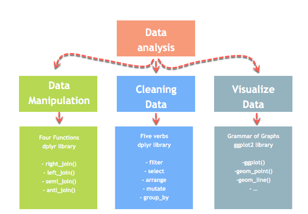
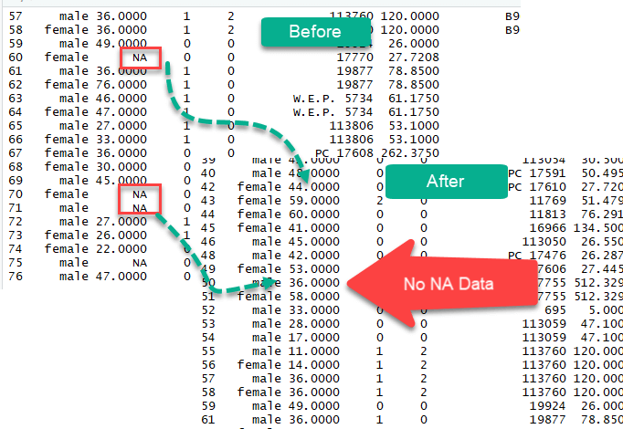

```{r setup, include=FALSE}
knitr::opts_chunk$set(
  echo = TRUE,
  fig.align = "center",
  message = FALSE,
  warning = FALSE
)
```

Missing values (NA) occur when observations are not recorded or when values cannot be parsed correctly. Before modeling or summarizing data, you should decide whether to **remove** missing rows or **impute** missing values.

In this lesson you will learn how to:
- Identify which columns contain missing values
- Remove rows containing missing values
- Impute missing values using the mean or the median

<p align="center">

</p>

# mutate()

`mutate()` is one of the core verbs in dplyr. It is useful to create new variables or modify existing ones.

Basic syntax:

```{r, eval=FALSE}
dplyr::mutate(df, new_var = expression, ...)
```

# Identify missing values

We will use a Titanic dataset with missing values.

```{r}
library(dplyr)
library(readr)

path <- "raw_data/test.csv"
df_titanic <- readr::read_csv(path, show_col_types = FALSE)

# Column names containing at least one NA
cols_with_na <- names(df_titanic)[colSums(is.na(df_titanic)) > 0]
cols_with_na

# Count missing values by column (only those with NA)
na_counts <- sort(colSums(is.na(df_titanic))[cols_with_na], decreasing = TRUE)
na_counts
```

# Exclude missing values (na.omit)

A simple way to remove rows with missing values is `na.omit()`. Note: `na.omit()` is a base R function (from `stats`) that removes observations containing missing values. [web:677]

```{r}
df_titanic_drop <- stats::na.omit(df_titanic)

dim(df_titanic)
dim(df_titanic_drop)
```

<p align="center">

</p>

# Impute missing values (mean / median)

Removing rows is easy, but it may discard a lot of information. A common alternative is to impute missing values. Here we show mean and median imputation for numeric columns only.

## Step 1: Select numeric columns that contain NA

```{r}
numeric_cols <- names(dplyr::select(df_titanic, where(is.numeric)))
na_numeric_cols <- intersect(cols_with_na, numeric_cols)

na_numeric_cols
```

## Step 2: Compute mean/median for those columns

```{r}
mean_by_col <- sapply(df_titanic[na_numeric_cols], mean, na.rm = TRUE)
median_by_col <- sapply(df_titanic[na_numeric_cols], median, na.rm = TRUE)

mean_by_col
median_by_col
```

## Step 3: Create new variables with imputed values

Using `tidyr::replace_na()` is a clean way to replace NA values with a constant. [web:680]  
Combined with `dplyr::across()`, it scales to many columns easily. [web:681]

```{r}
library(tidyr)

df_titanic_imputed <- df_titanic |>
  dplyr::mutate(
    # Mean imputation: create new columns
    dplyr::across(
      dplyr::all_of(na_numeric_cols),
      ~ tidyr::replace_na(.x, mean(.x, na.rm = TRUE)),
      .names = "impute_mean_{.col}"
    ),
    # Median imputation: create new columns
    dplyr::across(
      dplyr::all_of(na_numeric_cols),
      ~ tidyr::replace_na(.x, median(.x, na.rm = TRUE)),
      .names = "impute_median_{.col}"
    )
  )

df_titanic_imputed |>
  dplyr::select(dplyr::all_of(na_numeric_cols), starts_with("impute_")) |>
  dplyr::slice(1:10)
```

## Check that imputation worked

```{r}
# Example check: if Age exists in the data
if ("Age" %in% names(df_titanic_imputed)) {
  c(
    missing_original = sum(is.na(df_titanic_imputed$Age)),
    missing_mean_imp = sum(is.na(df_titanic_imputed$impute_mean_Age)),
    missing_med_imp  = sum(is.na(df_titanic_imputed$impute_median_Age))
  )
}
```

# na.rm

When computing statistics on vectors with missing values, you often need `na.rm = TRUE` (e.g., `mean(x, na.rm = TRUE)`) so that missing values are ignored.

# Summary

```{r, echo=FALSE}
library(knitr)

dt <- data.frame(
  Library = c("Base (stats)", "Base", "dplyr + tidyr"),
  Objective = c("Remove rows with NA", "List columns with NA", "Impute NA (mean/median)"),
  Code = c(
    "stats::na.omit(df)",
    "names(df)[colSums(is.na(df)) > 0]",
    "df |> mutate(across(cols, ~replace_na(.x, mean(.x, na.rm=TRUE))))"
  )
)

k <- knitr::kable(dt)

if (requireNamespace("kableExtra", quietly = TRUE)) {
  k <- kableExtra::kable_styling(k, bootstrap_options = c("striped", "hover"))
}

k
```
