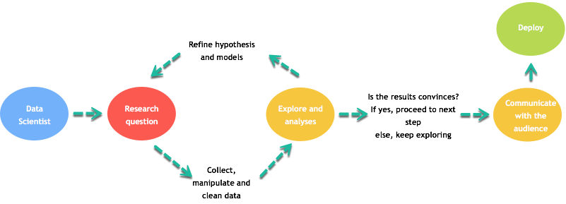

```{r setup, include=FALSE}
knitr::opts_chunk$set(
  echo = TRUE,
  fig.align = "center",
  message = FALSE,
  warning = FALSE
)
```

Graphs are a key part of data analysis and communication. A typical workflow includes:

- Defining a research question.
- Collecting, cleaning, and transforming data.
- Exploring patterns and refining hypotheses.
- Communicating results clearly to stakeholders.

Visualizations are often the fastest way to make complex ideas understandable.

<p align="center">

</p>

# The ggplot2 package

This lesson focuses on creating charts with **ggplot2**, which is based on Wilkinson’s *Grammar of Graphics* (2005). ggplot2 is flexible and supports many geoms, themes, and transformations, but it does not provide true 3D plots or interactive graphics out of the box.

A ggplot can be built from:

- Data
- Aesthetic mappings (`aes()`)
- Geometric objects (geoms)
- Statistical transformations (stats)
- Scales
- Coordinate systems
- Faceting

The basic syntax is:

```{r, eval=FALSE}
ggplot(data, aes(...)) + geom_*(...)
```

# Scatter plot

We will use `mtcars` and start with a simple scatter plot.

## Basic scatter plot

```{r}
library(ggplot2)

ggplot(mtcars, aes(x = drat, y = mpg)) +
  geom_point() +
  theme_classic()
```

## Scatter plot with groups

To color points by a categorical variable, map `color` inside `aes()`. Here we treat `gear` as a factor.

```{r}
ggplot(mtcars, aes(x = mpg, y = drat, color = factor(gear))) +
  geom_point() +
  theme_classic() +
  labs(color = "Gears")
```

## Transform axes (log scale)

A common strategy to reduce the impact of extreme values is to transform variables. Here we apply a log transform:

```{r}
ggplot(mtcars, aes(x = log(mpg), y = log(drat), color = factor(gear))) +
  geom_point() +
  theme_classic() +
  labs(color = "Gears")
```

# Add a fitted line

You can add a fitted regression line with `stat_smooth(method = "lm")`.

```{r}
my_graph <- ggplot(mtcars, aes(x = log(mpg), y = log(drat), color = factor(gear))) +
  geom_point() +
  stat_smooth(
    method = "lm",
    se = FALSE,
    color = "#C42126",
    linewidth = 1
  ) +
  theme_classic() +
  labs(color = "Gears")

my_graph
```

# Make the plot informative

Good charts should be readable without extra documentation. Use `labs()` to add titles and axis labels.

## Add a title

```{r}
my_graph +
  labs(title = "log(drat) vs log(mpg)")
```

## Dynamic title (example)

```{r}
mean_mpg <- mean(mtcars$mpg)

my_graph +
  labs(
    title = paste("log(drat) vs log(mpg) — mean mpg:", round(mean_mpg, 2))
  )
```

## Add subtitle and caption

```{r}
my_graph +
  labs(
    title = "Relationship between log(mpg) and log(drat)",
    subtitle = "Colored by gear class",
    caption = "Source: mtcars (datasets package)"
  )
```

## Rename axes and legend title

```{r}
my_graph +
  labs(
    x = "log(miles per gallon)",
    y = "log(rear axle ratio: drat)",
    color = "Gears",
    title = "Relationship between log(mpg) and log(drat)",
    subtitle = "Colored by gear class",
    caption = "Source: mtcars (datasets package)"
  )
```

# Control scales

You can control axis breaks with `scale_*_continuous(breaks = ...)`.

```{r}
my_graph +
  scale_x_continuous(breaks = seq(1, 3.6, by = 0.2)) +
  scale_y_continuous(breaks = seq(0.6, 1.6, by = 0.1)) +
  labs(
    x = "log(miles per gallon)",
    y = "log(rear axle ratio: drat)",
    color = "Gears",
    title = "Relationship between log(mpg) and log(drat)"
  )
```

# Themes

ggplot2 includes multiple themes; switching theme changes the overall style.

```{r}
my_graph +
  theme_dark() +
  labs(
    x = "log(miles per gallon)",
    y = "log(rear axle ratio: drat)",
    color = "Gears",
    title = "Relationship between log(mpg) and log(drat)",
    subtitle = "Colored by gear class",
    caption = "Source: mtcars"
  )
```

# Save plots

`ggsave()` saves a plot to disk; by default it saves the last displayed plot, but it is safer to pass the plot explicitly.

```{r}
directory <- getwd()
directory
```

```{r}
plot_to_save <- my_graph +
  theme_dark() +
  labs(
    x = "log(miles per gallon)",
    y = "log(rear axle ratio: drat)",
    color = "Gears",
    title = "Relationship between log(mpg) and log(drat)",
    subtitle = "Colored by gear class",
    caption = "Source: mtcars"
  )

ggsave(
  filename = "my_fantastic_plot.png",
  plot = plot_to_save,
  dpi = 300
)
```

__Note__: opening a folder from R is OS-dependent; in many deployed environments (GitHub Actions, servers) it will not work, so it is usually better to rely on the printed path.

# Summary

```{r, echo=FALSE}
library(knitr)

dt <- data.frame(
  Objective = c(
    "Basic scatter plot",
    "Color by group",
    "Transform variables (log)",
    "Add fitted line",
    "Add labels (title/subtitle/caption)",
    "Control axis breaks",
    "Change theme",
    "Save plot"
  ),
  Example = c(
    "ggplot(df, aes(x, y)) + geom_point()",
    "ggplot(df, aes(x, y, color = factor(g))) + geom_point()",
    "ggplot(df, aes(log(x), log(y))) + geom_point()",
    "… + stat_smooth(method = 'lm', se = FALSE)",
    "… + labs(title = ..., subtitle = ..., caption = ...)",
    "… + scale_x_continuous(breaks = ...)",
    "… + theme_classic()/theme_dark()/…",
    "ggsave('plot.png', plot = p)"
  )
)

knitr::kable(dt)
```
