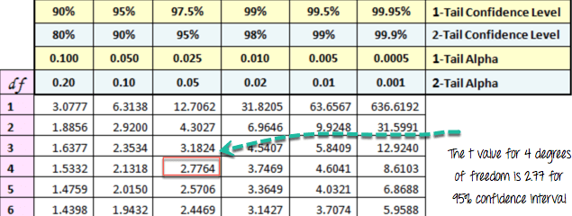

```{r setup, include=FALSE}
knitr::opts_chunk$set(echo = TRUE, fig.align="center", message=FALSE, warning = FALSE)
```

# What is Statistical Inference?

Stastitical inference is the art of generating conclusions about the distribution of the data. A data scientist is often exposed to question that can only be answered scientifically. Therefore, statistical inference is a strategy to test whether a hypothesis is true, i.e. validated by the data.

A common strategy to assess hypothesis is to conduct a t-test. A t-test can tell whether two groups have the same mean. A t-test is also called a __Student Test__. A t-test can be estimated for:

- A single vector (i.e., one-sample t-test)
- Two vectors from the same sample group (i.e., paired t-test).

You assume that both vectors are randomly sampled, independent and come from a normally distributed population with unknown but equal variances.

# What is t-test?

The basic idea behind a t-test is to use statistic to evaluate two contrary hypotheses:

- H0: NULL hypothesis: The average is the same as the sample used
- H1: True hypothesis: The average is different from the sample used

The t-test is commonly used with small sample sizes. To perform a t-test, you need to assume normality of the data. The basic syntax for `t.test()` is:

```{r, dont-eval, eval=FALSE}
t.test(x, y = NULL, mu = 0, var.equal = FALSE)
```

__arguments:__

- x : A vector to compute the one-sample t-test
- y: A second vector to compute the two sample t-test
- mu: Mean of the population- var.equal: Specify if the variance of the two vectors are equal. By default, set to `FALSE`

# One-sample t-test
The t-test, or student's test, compares the mean of a vector against a theoretical mean, . The formula used to compute the t-test is:

$$t = \frac{m - \mu}{\frac{s}{\sqrt{n}}}$$

Here

- $m$ refers to the mean
- $\mu$ to the theoretical mean
- $s$ is the standard deviation
- $n$ the number of observations.

To evaluate the statistical significance of the t-test, you need to compute the __p-value__. The __p-value__ ranges from 0 to 1, and is interpreted as follow:

- A p-value lower than 0.05 means you are strongly confident to reject the null hypothesis, thus H1 is accepted.
- A p-value higher than 0.05 indicates that you don't have enough evidences to reject the null hypothesis.

You can construct the pvalue by looking at the corresponding absolute value of the t-test in the Student distribution with a degrees of freedom equals to $df = n - 1$

For instance, if you have 5 observations, you need to compare our t-value with the t-value in the Student distribution with 4 degrees of freedom and at 95 percent confidence interval. To reject the null hypothesesis, the t-value should be higher than 2.77.

Cf table below:

<p align="center">

</p>

__Example:__

Suppose you are a company producing cookies. Each cookie is supposed to contain 10 grams of sugar. The cookies are produced by a machine that adds the sugar in a bowl before mixing everything. You believe the machine does not add 10 grams of sugar for each cookie. If your assumption is true, the machine needs to be fixed. You stored the level of sugar of thirty cookies.

Note: You can create a randomized vector with the function rnorm(). This function generates normally distributed values. The basic syntax is:

```{r, dont-eval1, eval=FALSE}
rnorm(n, mean, sd)
```

__arguments__

- n: Number of observations to generate
- mean: The mean of the distribution. Optional
- sd: The standard deviation of the distribution. Optional
You can create a distribution with 30 observations with a mean of 9.99 and a standard deviation of 0.04.

```{r}
set.seed(123) 
sugar_cookie <- rnorm(30, mean = 9.99, sd = 0.04)
head(sugar_cookie)
```

You can use a one-sample t-test to check whether the level of sugar is different than the recipe. You can draw a hypothesis test:

- H0: The average level of sugar is equal to 10
- H1: The average level of sugar is different than 10

You use a significance level of 0.05.

```{r, dont-eval2, eval=FALSE}
# H0 : mu = 10
t.test(sugar_cookie, mu = 10)	
```

<p align="center">

</p>

The p-value of the one sample t-test is 0.1079 and above 0.05. You can be confident at 95% that the amount of sugar added by the machine is between 9.973 and 10.002 grams. You cannot reject the null (H0) hypothesis. There is not enough evidence that amount of sugar added by the machine does not follow the recipe.

# Paired t-test

The paired t-test, or dependant sample t-test, is used when the mean of the treated group is computed twice. The basic application of the paired t-test is:

- A/B testing: Compare two variants
- Case control studies: Before/after treatment

__Example:__

A beverage company is interested in knowing the performance of a discount program on the sales. The company decided to follow the daily sales of one of its shops where the program is being promoted. At the end of the program, the company wants to know if there is a statistical difference between the average sales of the shop before and after the program.

The company tracked the sales everyday before the program started. This is our first vector.
The program is promoted for one week and the sales are recorded every day. This is our second vector.
You will perform the t-test to judge the effectiveness of the program. This is called a paired t-test because the values of both vectors come from the same distribution (i.e., the same shop).
The hypothesis testing is:

- H0: No difference in mean
- H1: The two means are different

Remember, one assumption in the t-test is an unknown but equal variance. In reality, the data barely have equal mean, and it leads to incorrect results for the t-test.

One solution to relax the equal variance assumption is to use the Welch's test. R assumes the two variances are not equal by default. In your dataset, both vectors have the same variance, you can set var.equal= TRUE.

You create two random vectors from a Gaussian distribution with a higher mean for the sales after the program.

```{r, dont-eval3, eval=FALSE}
set.seed(123)
# sales before the program
sales_before <- rnorm(7, mean = 50000, sd = 50)
# sales after the program.This has higher mean
sales_after <- rnorm(7, mean = 50075, sd = 50)
# draw the distribution
t.test(sales_before, sales_after,var.equal = TRUE)
```

<p align="center">

</p>

You obtained a p-value of 0.04606, lower than the threshold of 0.05. You conclude the averages of the two groups are significantly different. The program improves the sales of shops.

# Summary

The t-test belongs to the family of inferential statistics. It is commonly employed to find out if there is a statistical difference between the means of two groups.

We can summarize the t-test is the table below:

| test | Hypothesis to test | p-value | code | optional argument |
|:-----|:-------------------|:--------|:-----|:------------------|
| one-sample t-test | Mean of a vector is different from the theoretical mean | 0.05 | t.test(x, mu = mean) | |
| paired sample t-test | Mean A is different from mean B for the same group | 0.05 | t.test(A, B, mu = mean) | var.equal = TRUE |

If we assume the variances are equal, we need to change the parameter var.equal = TRUE.