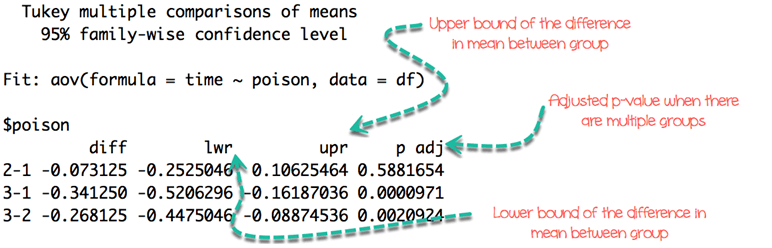

```{r setup, include=FALSE}
knitr::opts_chunk$set(echo = TRUE, fig.align="center", message=FALSE, warning = FALSE)
```

# What is ANOVA?

__Analysis of Variance (ANOVA)__ is a statistical technique, commonly used to studying differences between two or more group means. ANOVA test is centred on the different sources of variation in a typical variable. ANOVA in R primarily provides evidence of the existence of the mean equality between the groups. This statistical method is an extension of the t-test. It is used in a situation where the factor variable has more than one group.

# One-way ANOVA

There are many situations where you need to compare the mean between multiple groups. For instance, the marketing department wants to know if three teams have the same sales performance.

- Team: 3 level factor: A, B, and C
- Sale: A measure of performance

The ANOVA test can tell if the three groups have similar performances. To clarify if the data comes from the same population, you can perform a __one-way analysis of variance__ (one-way ANOVA hereafter). This test, like any other statistical tests, gives evidence whether the H0 hypothesis can be accepted or rejected.

## Hypothesis in one-way ANOVA test:

- H0: The means between groups are identical
- H1: At least, the mean of one group is different

In other words, the H0 hypothesis implies that there is not enough evidence to prove the mean of the group (factor) are different from another.

This test is similar to the t-test, although ANOVA test is recommended in situation with more than 2 groups. Except that, the t-test and ANOVA provide similar results.

## Assumptions

We assume that each factor is randomly sampled, independent and comes from a normally distributed population with unknown but equal variances.

## Interpret ANOVA test

The F-statistic is used to test if the data are from significantly different populations, i.e., different sample means.

To compute the F-statistic, you need to divide the __between-group variability__ over the __within-group variability__.

The __between-group variability__ reflects the differences between the groups inside all of the population. Look at the two graphs below to understand the concept of between-group variance.

The left graph shows very little variation between the three group, and it is very likely that the three means tends to the overall mean (i.e., mean for the three groups).

The right graph plots three distributions far apart, and none of them overlap. There is a high chance the difference between the total mean and the groups mean will be large.

<p align="center">

</p>

The __within group variability__ considers the difference between the groups. The variation comes from the individual observations; some points might be totally different than the group means. The within group variability picks up this effect and refer to the sampling error.

To understand visually the concept of within group variability, look at the graph below.

The left part plots the distribution of three different groups. You increased the spread of each sample and it is clear the individual variance is large. The F-test will decrease, meaning you tend to accept the null hypothesis

The right part shows exactly the same samples (identical mean) but with lower variability. It leads to an increase of the F-test and tends in favor of the alternative hypothesis.

<p align="center">

</p>

You can use both measures to construct the F-statistics. It is very intuitive to understand the F-statistic. If the numerator increases, it means the between-group variability is high, and it is likely the groups in the sample are drawn from completely different distributions.

In other words, a low F-statistic indicates little or no significant difference between the group's average.

## Example One way ANOVA Test

You will use the poison dataset to implement the one-way ANOVA test. The dataset contains 48 rows and 3 variables:

- Time: Survival time of the animal
- poison: Type of poison used: factor level: 1,2 and 3
- treat: Type of treatment used: factor level: 1,2 and 3

Before you start to compute the ANOVA test, you need to prepare the data as follow:

- Step 1: Import the data
- Step 2: Remove unnecessary variable
- Step 3: Convert the variable poison as ordered level

```{r}
library(dplyr)
PATH <- "https://raw.githubusercontent.com/guru99-edu/R-Programming/master/poisons.csv"
df <- read.csv(PATH) %>% select(-X) %>% mutate(poison = factor(poison, ordered = TRUE))
glimpse(df)
```

Our objective is to test the following assumption:

- H0: There is no difference in survival time average between group
- H1: The survival time average is different for at least one group.

In other words, you want to know if there is a statistical difference between the mean of the survival time according to the type of poison given to the Guinea pig.

You will proceed as follow:

- Step 1: Check the format of the variable poison
- Step 2: Print the summary statistic: count, mean and standard deviation
- Step 3: Plot a box plot
- Step 4: Compute the one-way ANOVA test
- Step 5: Run a pairwise t-test

__Step 1)__ You can check the level of the poison with the following code. You should see three character values because you convert them in factor with the mutate verb.

```{r}
levels(df$poison)
```

__Step 2)__ You compute the mean and standard deviation.

```{r}
df %>%
	group_by(poison) %>%
	summarise(
		count_poison = n(),
		mean_time = mean(time, na.rm = TRUE),
		sd_time = sd(time, na.rm = TRUE)
	)
```

__Step 3)__ In step three, you can graphically check if there is a difference between the distribution. Note that you include the jittered dot.

```{r}
library(ggplot2)
ggplot(df, aes(x = poison, y = time, fill = poison)) +
    geom_boxplot() +
    geom_jitter(shape = 15,
        color = "steelblue",
        position = position_jitter(0.21)) +
    theme_classic()
```

__Step 4)__ You can run the one-way ANOVA test with the command aov. The basic syntax for an ANOVA test is:

```{r, dont-eval, eval = FALSE}
aov(formula, data)
```

__arguments:__

- formula: The equation you want to estimate
- data: The dataset used	

The syntax of the formula is:

```{r, dont-eval2, eval = FALSE}
y ~ X1+ X2+...+Xn # X1 +  X2 +... refers to the independent variables
y ~ . # use all the remaining variables as independent variables
```

You can answer our question: Is there any difference in the survival time between the Guinea pig, knowing the type of poison given.

Note that, it is advised to store the model and use the function summary() to get a better print of the results.

```{r}
anova_one_way <- aov(time~poison, data = df)
summary(anova_one_way)
```

__Code Explanation__

- aov(time ~ poison, data = df): Run the ANOVA test with the following formula
- summary(anova_one_way): Print the summary of the test

The p-value is lower than the usual threshold of 0.05. You are confident to say there is a statistical difference between the groups, indicated by the "*".

## Pairwise comparison

The one-way ANOVA test does not inform which group has a different mean. Instead, you can perform a Tukey test with the function TukeyHSD().

```{r, dont-eval3, eval = FALSE}
TukeyHSD(anova_one_way)
```

__Output__

<p align="center">

</p>

# Two-way ANOVA

A two-way ANOVA test adds another group variable to the formula. It is identical to the one-way ANOVA test, though the formula changes slightly:

$$y = x_1 + x_2$$

with is a quantitative variable and and are categorical variables.

## Hypothesis in two-way ANOVA test:

- H0: The means are equal for both variables (i.e., factor variable)
- H1: The means are different for both variables

You add treat variable to our model. This variable indicates the treatment given to the Guinea pig. You are interested to see if there is a statistical dependence between the poison and treatment given to the Guinea pig.

We adjust our code by adding treat with the other independent variable.

```{r}
anova_two_way <- aov(time~poison + treat, data = df)
summary(anova_two_way)
```

You can conclude that both poison and treat are statistically different from 0. You can reject the NULL hypothesis and confirm that changing the treatment or the poison impact the time of survival.

# Summary

We can summarize the test in the table below:

```{r, echo=FALSE}
library(knitr)
library(kableExtra)
dt <- data.frame(
  "test" = c("One way ANOVA", "Pairwise", "Two way ANOVA"), 
  "hypothesis" = c("H1: Average is different for at least one group", "-", "H1: Average is different for both group"),
  "code" = c("aov(y ~ X, data = df)", "TukeyHSD(ANOVA summary)", "aov(y ~ X1 + X2, data = df)"))
kable(dt) %>% kable_styling(bootstrap_options = c("striped", "hover"))
```