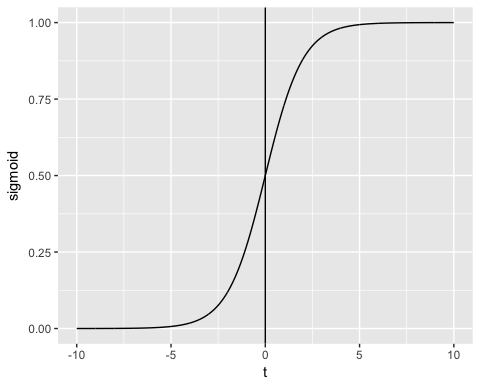
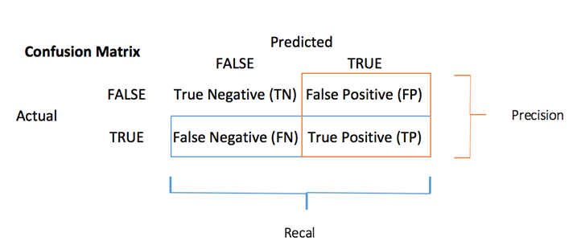

```{r setup, include=FALSE}
knitr::opts_chunk$set(echo = TRUE, fig.align="center", message=FALSE, warning = FALSE)
```

# What is Logistic regression?

Logistic regression is used to predict a class, i.e., a probability. Logistic regression can predict a binary outcome accurately.

Imagine you want to predict whether a loan is denied/accepted based on many attributes. The logistic regression is of the form 0/1. $y = 0$ if a loan is rejected, $y = 1$ if accepted.

A logistic regression model differs from linear regression model in two ways.

- First of all, the logistic regression accepts only dichotomous (binary) input as a dependent variable (i.e., a vector of 0 and 1).
- Secondly, the outcome is measured by the following probabilistic link function called sigmoid due to its S-shaped.:

$$\sigma(t)=\frac{1}{1+\exp(-t)}$$
The output of the function is always between 0 and 1. Check Image below

<p align="center">

</p>

The sigmoid function returns values from 0 to 1. For the classification task, we need a discrete output of 0 or 1.

To convert a continuous flow into discrete value, we can set a decision bound at 0.5. All values above this threshold are classified as 1.

# How to create Generalized Liner Model (GLM)

Let's use the adult data set to illustrate Logistic regression. The "adult" is a great dataset for the classification task. The objective is to predict whether the annual income in dollar of an individual will exceed 50.000. The dataset contains 46,033 observations and ten features:

- age: age of the individual. Numeric
- education: Educational level of the individual. Factor.
- marital.status: Marital status of the individual. Factor i.e. Never-married, Married-civ-spouse, ...
- gender: Gender of the individual. Factor, i.e. Male or Female
- income: Target variable. Income above or below 50K. Factor i.e. >50K, <=50K

amongst others

```{r}
library(dplyr)
data_adult <- read.csv("https://raw.githubusercontent.com/guru99-edu/R-Programming/master/adult.csv", 
                       stringsAsFactors = TRUE)
glimpse(data_adult)
```
We will proceed as follow:

- Step 1: Check continuous variables
- Step 2: Check factor variables
- Step 3: Feature engineering
- Step 4: Summary statistic
- Step 5: Train/test set
- Step 6: Build the model
- Step 7: Assess the performance of the model
- Step 8: Improve the model

Your task is to predict which individual will have a revenue higher than 50K.

## Step 1) Check continuous variables

In the first step, you can see the distribution of the continuous variables.
```{r}
continuous <- select_if(data_adult, is.numeric)
summary(continuous)
```
__Code Explanation__

- continuous <- select_if(data_adult, is.numeric): Use the function _select_if()_ from the dplyr library to select only the numerical columns
- summary(continuous): Print the summary statistic

From the above table, you can see that the data have totally different scales and hours.per.weeks has large outliers (.i.e. look at the last quartile and maximum value).

You can deal with it following two steps:

1. Plot the distribution of hours.per.week
1. Standardize the continuous variables

1) Plot the distribution: Let's look closer at the distribution of hours.per.week

```{r}
# Histogram with kernel density curve
library(ggplot2)
ggplot(continuous, aes(x = hours.per.week)) +
  geom_density(alpha = .2, fill = "#FF6666")
```
The variable has lots of outliers and not well-defined distribution. You can partially tackle this problem by deleting the top 0.01 percent of the hours per week.

Basic syntax of quantile:
```{r, dont-eval, eval = FALSE}
quantile(variable, percentile)
```

__arguments:__

- variable:  Select the variable in the data frame to compute the percentile
- percentile:  Can be a single value between 0 and 1 or multiple value. If multiple, use this format:  `c(A,B,C, ...)
- 'A', 'B', 'C and '...' are all integer from 0 to 1.

We compute the top 2 percent percentile

```{r}
top_one_percent <- quantile(data_adult$hours.per.week, .99)
top_one_percent
```

__Code Explanation__

- quantile(data_adult$hours.per.week, .99): Compute the value of the 99 percent of the working time

98 percent of the population works under 80 hours per week.

You can drop the observations above this threshold. You use the filter from the dplyr library.

```{r}
data_adult_drop <- data_adult %>% filter(hours.per.week < top_one_percent)
dim(data_adult_drop)
```
2) Standardize the continuous variables

You can standardize each column to improve the performance because your data do not have the same scale. You can use the function mutate_if from the dplyr library. The basic syntax is:
```{r, dont-eval1, eval = FALSE}
mutate_if(df, condition, funs(function))
```

__arguments:__

- 'df': Data frame used to compute the function
- 'condition': Statement used. Do not use parenthesis
- funs(function):  Return the function to apply. Do not use parenthesis for the function

You can standardize the numeric columns as follow:

```{r}
data_adult_rescale <- data_adult_drop %>%
	mutate_if(is.numeric, funs(as.numeric(scale(.))))
head(data_adult_rescale)
```
__Code Explanation__

- mutate_if(is.numeric, funs(scale)): The condition is only numeric column and the function is scale

## Step 2) Check factor variables

This step has two objectives:

- Check the level in each categorical column
- Define new levels

We will divide this step into three parts:

- Select the categorical columns
- Store the bar chart of each column in a list
- Print the graphs

We can select the factor columns with the code below:
```{r}
# Select categorical column
factor <- data.frame(select_if(data_adult_rescale, is.factor))
ncol(factor)
```
The dataset contains 6 categorical variables.

The second step is more skilled. You want to plot a bar chart for each column in the data frame factor. It is more convenient to automatize the process, especially in situation there are lots of columns.
```{r}
library(ggplot2)
# Create graph for each column
graph <- lapply(names(factor), function(x) ggplot(factor, aes(get(x))) + geom_bar() +
                  theme(axis.text.x = element_text(angle = 90)))
```
__Code Explanation__

- lapply(): Use the function _lapply()_ to pass a function in all the columns of the dataset. You store the output in a list
- function(x): The function will be processed for each x. Here x is the columns
- ggplot(factor, aes(get(x))) + geom_bar()+ theme(axis.text.x = element_text(angle = 90)): Create a bar char chart for each x element. Note, to return x as a column, you need to include it inside the get()

The last step is relatively easy. You want to print the 6 graphs.
```{r}
# Print the graph
graph
```
## Step 3) Feature engineering

__Recast education__

From the graph above, you can see that the variable education has 16 levels. This is substantial, and some levels have a relatively low number of observations. If you want to improve the amount of information you can get from this variable, you can recast it into higher level. Namely, you create larger groups with similar level of education. For instance, low level of education will be converted in dropout. Higher levels of education will be changed to master.
```{r}
recast_data <- data_adult_rescale %>% select(-x) %>%
	mutate(education = factor(ifelse(education == "Preschool" | education == "10th" | education == "11th" | education == "12th" | education == "1st-4th" | education == "5th-6th" | education == "7th-8th" | education == "9th", "dropout", ifelse(education == "HS-grad", "HighGrad", ifelse(education == "Some-college" | education == "Assoc-acdm" | education == "Assoc-voc", "Community",
    ifelse(education == "Bachelors", "Bachelors",
        ifelse(education == "Masters" | education == "Prof-school", "Master", "PhD")))))))
```
__Code Explanation__

- We use the verb mutate from dplyr library. We change the values of education with the statement ifelse.

In the table below, you create a summary statistic to see, on average, how many years of education (z-value) it takes to reach the Bachelor, Master or PhD.
```{r}
recast_data %>% group_by(education) %>% 
  dplyr::summarize(average_educ_year = mean(educational.num), count = n()) %>%
	arrange(average_educ_year)
```
__Recast Marital-status__

```{r}
# Change level marry
recast_data <- recast_data %>%
	mutate(marital.status = factor(ifelse(marital.status == "Never-married" | marital.status == "Married-spouse-absent", "Not_married", ifelse(marital.status == "Married-AF-spouse" | marital.status == "Married-civ-spouse", "Married", ifelse(marital.status == "Separated" | marital.status == "Divorced", "Separated", "Widow")))))
```
You can check the number of individuals within each group.
```{r}
table(recast_data$marital.status)
```
## Step 4) Summary Statistic

It is time to check some statistics about our target variables. In the graph below, you count the percentage of individuals earning more than 50k given their gender.
```{r}
# Plot gender income
ggplot(recast_data, aes(x = gender, fill = income)) + geom_bar(position = "fill") + theme_classic()
```
Next, check if the origin of the individual affects their earning.
```{r}
# Plot origin income
ggplot(recast_data, aes(x = race, fill = income)) +
    geom_bar(position = "fill") +
    theme_classic() +
    theme(axis.text.x = element_text(angle = 90))
```
The number of hours work by gender.
```{r}
# box plot gender working time
ggplot(recast_data, aes(x = gender, y = hours.per.week)) +
    geom_boxplot() +
    stat_summary(fun.y = mean,
        geom = "point",
        size = 3,
        color = "steelblue") +
    theme_classic()
```
The box plot confirms that the distribution of working time fits different groups. In the box plot, both genders do not have homogeneous observations.

You can check the density of the weekly working time by type of education. The distributions have many distinct picks. It can probably be explained by the type of contract in the US.
```{r}
# Plot distribution working time by education
ggplot(recast_data, aes(x = hours.per.week)) +
    geom_density(aes(color = education), alpha = 0.5) +
    theme_classic()
```
__Code Explanation__

- ggplot(recast_data, aes( x= hours.per.week)): A density plot only requires one variable
- geom_density(aes(color = education), alpha =0.5): The geometric object to control the density

To confirm your thoughts, you can perform a one-way ANOVA test:
```{r}
anova <- aov(hours.per.week~education, recast_data)
summary(anova)
```
The ANOVA test confirms the difference in average between groups.

__Non-linearity__

Before you run the model, you can see if the number of hours worked is related to age.
```{r}
library(ggplot2)
ggplot(recast_data, aes(x = age, y = hours.per.week)) +
    geom_point(aes(color = income),
        size = 0.5) +
    stat_smooth(method = 'lm',
        formula = y~poly(x, 2),
        se = TRUE,
        aes(color = income)) +
    theme_classic()
```
	
__Code Explanation__

- ggplot(recast_data, aes(x = age, y = hours.per.week)): Set the aesthetic of the graph
- geom_point(aes(color= income), size =0.5): Construct the dot plot
- stat_smooth(): Add the trend line with the following arguments:
    - method='lm': Plot the fitted value if the linear regression
    - formula = y~poly(x,2): Fit a polynomial regression
    - se = TRUE: Add the standard error
    - aes(color= income): Break the model by income

In a nutshell, you can test interaction terms in the model to pick up the non-linearity effect between the weekly working time and other features. It is important to detect under which condition the working time differs.

__Correlation__

The next check is to visualize the correlation between the variables. You convert the factor level type to numeric so that you can plot a heat map containing the coefficient of correlation computed with the Spearman method.
```{r}
library(GGally)
# Convert data to numeric
corr <- data.frame(lapply(recast_data, as.integer))
# Plot the graph
ggcorr(corr,
    method = c("pairwise", "spearman"),
    nbreaks = 6,
    hjust = 0.8,
    label = TRUE,
    label_size = 3,
    color = "grey50")
```
__Code Explanation__

- data.frame(lapply(recast_data,as.integer)): Convert data to numeric
- ggcorr() plot the heat map with the following arguments:
    - method: Method to compute the correlation
    - nbreaks = 6: Number of break
    - hjust = 0.8: Control position of the variable name in the plot
    - label = TRUE: Add labels in the center of the windows
    - label_size = 3: Size labels
    - color = "grey50": Color of the label

## Step 5) Train/test set

Any supervised machine learning task require to split the data between a train set and a test set. You can use the "function" you created in the other supervised learning tutorials to create a train/test set.
```{r}
set.seed(1234)
create_train_test <- function(data, size = 0.8, train = TRUE) {
    n_row = nrow(data)
    total_row = size * n_row
    train_sample <- 1: total_row
    if (train == TRUE) {
        return (data[train_sample, ])
    } else {
        return (data[-train_sample, ])
    }
}
data_train <- create_train_test(recast_data, 0.8, train = TRUE)
data_test <- create_train_test(recast_data, 0.8, train = FALSE)
dim(data_train)
```
```{r}
dim(data_test)
```
## Step 6) Build the model

To see how the algorithm performs, you use the glm() package. The Generalized Linear Model is a collection of models. The basic syntax is:
```{r, dont-eval4, eval = FALSE}
glm(formula, data=data, family=linkfunction())
```
__Argument:__

- formula:  Equation used to fit the model- data: dataset used
- Family:     - binomial: (link = "logit")			
- gaussian: (link = "identity")			
- Gamma:    (link = "inverse")			
- inverse.gaussian: (link = "1/mu^2")			
- poisson:  (link = "log")			
- quasi:    (link = "identity", variance = "constant")			
- quasibinomial:    (link = "logit")			
- quasipoisson: (link = "log")	

You are ready to estimate the logistic model to split the income level between a set of features.
```{r}
formula <- income ~ .
logit <- glm(formula, data = data_train, family = 'binomial')
summary(logit)
```

__Code Explanation__

- formula <- income ~ .: Create the model to fit
- logit <- glm(formula, data = data_train, family = 'binomial'): Fit a logistic model (family = 'binomial') with the data_train data.
- summary(logit): Print the summary of the model

The summary of our model reveals interesting information. The performance of a logistic regression is evaluated with specific key metrics.

- AIC (Akaike Information Criteria): This is the equivalent of R2 in logistic regression. It measures the fit when a penalty is applied to the number of parameters. Smaller AIC values indicate the model is closer to the truth.
- Null deviance: Fits the model only with the intercept. The degree of freedom is $n-1$. We can interpret it as a - Chi-square value (fitted value different from the actual value hypothesis testing).
- Residual Deviance: Model with all the variables. It is also interpreted as a Chi-square hypothesis testing.
- Number of Fisher Scoring iterations: Number of iterations before converging.

The output of the glm() function is stored in a list. The code below shows all the items available in the logit variable we constructed to evaluate the logistic regression.
```{r}
# The list is very long, print only the first three elements
lapply(logit, class)[1:3]
```
Each value can be extracted with the $ sign follow by the name of the metrics. For instance, you stored the model as logit. To extract the AIC criteria, you use:
```{r}
logit$aic
```
## Step 7) Assess the performance of the model

__Confusion Matrix__

The __confusion matrix__ is a better choice to evaluate the classification performance compared with the different metrics you saw before. The general idea is to count the number of times True instances are classified are False.

<p align="center">

</p>

To compute the confusion matrix, you first need to have a set of predictions so that they can be compared to the actual targets.
```{r}
predict <- predict(logit, data_test, type = 'response')
# confusion matrix
table_mat <- table(data_test$income, predict > 0.5)
table_mat
```
__Code Explanation__

- predict(logit,data_test, type = 'response'): Compute the prediction on the test set. Set type = 'response' to compute the response probability.
- table(data_test$income, predict > 0.5): Compute the confusion matrix. predict > 0.5 means it returns 1 if the predicted probabilities are above 0.5, else 0.

Each row in a confusion matrix represents an actual target, while each column represents a predicted target. The first row of this matrix considers the income lower than 50k (the False class): 6241 were correctly classified as individuals with income lower than 50k (True negative), while the remaining one was wrongly classified as above 50k (False positive). The second row considers the income above 50k, the positive class were 1229 (True positive), while the True negative was 1074.

You can calculate the model accuracy by summing the true positive + true negative over the total observation
$$\text{accuracy}=\frac{TP+TN}{TP+TN+FP+FN}$$
```{r}
accuracy_Test <- sum(diag(table_mat)) / sum(table_mat)
accuracy_Test
```
__Code Explanation__

- sum(diag(table_mat)): Sum of the diagonal
- sum(table_mat): Sum of the matrix.

The model appears to suffer from one problem, it overestimates the number of false negatives. This is called the __accuracy test paradox__. We stated that the accuracy is the ratio of correct predictions to the total number of cases. We can have relatively high accuracy but a useless model. It happens when there is a dominant class. If you look back at the confusion matrix, you can see most of the cases are classified as true negative. Imagine now, the model classified all the classes as negative (i.e. lower than 50k). You would have an accuracy of 75 percent (6718/6718+2257). Your model performs better but struggles to distinguish the true positive with the true negative.

In such situation, it is preferable to have a more concise metric. We can look at:

- $\text{Precision} = TP/(TP+FP)$
- $\text{Recall} = TP/(TP+FN)$

__Precision vs Recall__

Precision looks at the accuracy of the positive prediction. Recall is the ratio of positive instances that are correctly detected by the classifier;

You can construct two functions to compute these two metrics
```{r}
# Construct precision
precision <- function(matrix) {
	# True positive
    tp <- matrix[2, 2]
	# false positive
    fp <- matrix[1, 2]
    return (tp / (tp + fp))
}
```
__Code Explanation__

- mat[1,1]: Return the first cell of the first column of the data frame, i.e. the true positive
- mat[1,2]; Return the first cell of the second column of the data frame, i.e. the false positive
```{r}
recall <- function(matrix) {
# true positive
    tp <- matrix[2, 2]# false positive
    fn <- matrix[2, 1]
    return (tp / (tp + fn))
}
```
__Code Explanation__

- mat[1,1]: Return the first cell of the first column of the data frame, i.e. the true positive
- mat[2,1]; Return the second cell of the first column of the data frame, i.e. the false negative

You can test your functions
```{r}
prec <- precision(table_mat)
prec
rec <- recall(table_mat)
rec
```
When the model says it is an individual above 50k, it is correct in only 54 percent of the case, and can claim individuals above 50k in 72 percent of the case.

You can create the  score based on the precision and recall. The  is a harmonic mean of these two metrics, meaning it gives more weight to the lower values.
$$F_1=2*\frac{precision*recall}{precision+recall}$$
```{r}
f1 <- 2 * ((prec * rec) / (prec + rec))
f1
```

__Precision vs Recall tradeoff__

It is impossible to have both a high precision and high recall.

If we increase the precision, the correct individual will be better predicted, but we would miss lots of them (lower recall). In some situation, we prefer higher precision than recall. There is a concave relationship between precision and recall.

- Imagine, you need to predict if a patient has a disease. You want to be as precise as possible.
- If you need to detect potential fraudulent people in the street through facial recognition, it would be better to catch many people labeled as fraudulent even though the precision is low. The police will be able to release the non-fraudulent individual.

__The ROC curve__

The __Receiver Operating Characteristic__ curve is another common tool used with binary classification. It is very similar to the precision/recall curve, but instead of plotting precision versus recall, the ROC curve shows the true positive rate (i.e., recall) against the false positive rate. The false positive rate is the ratio of negative instances that are incorrectly classified as positive. It is equal to one minus the true negative rate. The true negative rate is also called __specificity__. Hence the ROC curve plots __sensitivity__ (recall) versus 1-specificity

To plot the ROC curve, we need to install a library called RORC. 

We can plot the ROC with the prediction() and performance() functions.
```{r}
library(ROCR)
ROCRpred <- prediction(predict, data_test$income)
ROCRperf <- performance(ROCRpred, 'tpr', 'fpr')
plot(ROCRperf, colorize = TRUE, text.adj = c(-0.2, 1.7))
```
__Code Explanation__

- prediction(predict, data_test$income): The ROCR library needs to create a prediction object to transform the input data
- performance(ROCRpred, 'tpr','fpr'): Return the two combinations to produce in the graph. Here, tpr and fpr are constructed. Tot plot precision and recall together, use "prec", "rec".

## Step 8) Improve the model

You can try to add non-linearity to the model with the interaction between

- age and hours.per.week
- gender and hours.per.week.

You need to use the score test to compare both model
```{r}
formula_2 <- income ~ age:hours.per.week + gender:hours.per.week + .
logit_2 <- glm(formula_2, data = data_train, family = 'binomial')
predict_2 <- predict(logit_2, data_test, type = 'response')
table_mat_2 <- table(data_test$income, predict_2 > 0.5)
precision_2 <- precision(table_mat_2)
recall_2 <- recall(table_mat_2)
f1_2 <- 2 * ((precision_2 * recall_2) / (precision_2 + recall_2))
f1_2
```
The score is slightly higher than the previous one. You can keep working on the data a try to beat the score.

# Summary

Ordinary least squared regression can be summarized in the table below:

```{r, echo=FALSE}
library(knitr)
library(kableExtra)
dt <- data.frame(
  "Library" = c("glm", "glm", "base", "base", "base", "ROCR", "ROCR", "ROCR"), 
  "Objective" = c("Train a Generalized Linear Model", "Summarize the model", "Make prediction", "Create a confusion matrix", "Create accuracy score", "Create ROC : Step 1 Create prediction", "Create ROC : Step 2 Create performance", 
                  "Create ROC : Step 3 Plot graph"),
  "Function" = c("glm()", "summary()", "predict()", "table()", "sum(diag(table())/sum(table()", "prediction()",
                 "performance()", "plot()"),
  "Arguments" = c("formula, data, family", "fitted model", "fitted model, dataset, type = 'response'", "y, predict()", "-", "predict(), y", "prediction(), 'tpr', 'fpr'", "performance()"))
kable(dt) %>% kable_styling(bootstrap_options = c("striped", "hover"))
```