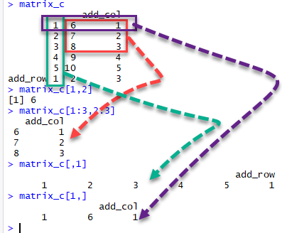

```{r setup, include=FALSE}
knitr::opts_chunk$set(
  echo = TRUE,
  fig.align = "center",
  message = FALSE,
  warning = FALSE
)
```

# What is a matrix?

A matrix is a 2-dimensional array with \(m\) rows and \(n\) columns. All elements in a matrix have the same underlying type (numeric, character, logical, ...). [web:848]

<p align="center">

</p>

# Create a matrix in R

Use `matrix()`:

```{r, eval=FALSE}
matrix(data, nrow = 1, ncol = 1, byrow = FALSE)
```

Key arguments: [web:848]
- `data`: vector (or other object) used to fill the matrix
- `nrow`: number of rows
- `ncol`: number of columns
- `byrow`: if `FALSE` (default) fill column-wise; if `TRUE` fill row-wise

## Example: byrow = TRUE vs FALSE

```{r}
matrix_a <- matrix(1:10, nrow = 5, ncol = 2, byrow = TRUE)
matrix_a
dim(matrix_a)

matrix_b <- matrix(1:10, nrow = 5, ncol = 2, byrow = FALSE)
matrix_b
dim(matrix_b)
```

## Example: create a 4x3 matrix with ncol

```{r}
matrix_c <- matrix(1:12, ncol = 3)
matrix_c
dim(matrix_c)
```

# Add columns/rows (cbind / rbind) {#buttons .tabset .tabset-fade .tabset-pills}

`cbind()` binds objects by columns and `rbind()` binds objects by rows. [web:862]

## Add one column with cbind()

```{r}
matrix_a1 <- cbind(matrix_a, 1:5)
matrix_a1
dim(matrix_a1)
```

## Bind two matrices by columns

To bind matrices with `cbind()`, they must have the same number of rows. [web:862]

```{r}
left  <- matrix(1:12,  ncol = 3)   # 4x3
right <- matrix(13:24, ncol = 3)   # 4x3

matrix_d <- cbind(left, right)     # 4x6
matrix_d
dim(matrix_d)
```

## Add one row with rbind()

To bind matrices with `rbind()`, they must have the same number of columns. [web:862]

```{r}
matrix_c2 <- matrix(1:12, ncol = 3)  # 4x3
new_row <- c(1, 2, 3)

matrix_c2 <- rbind(matrix_c2, new_row)  # 5x3
matrix_c2
dim(matrix_c2)
```

# Slice a matrix

Use square brackets `[row, col]`. A comma separates row selection from column selection. [web:857]

Examples:
- `m[1, 2]` selects row 1, column 2.
- `m[1:3, 2:3]` selects rows 1–3 and columns 2–3.
- `m[, 1]` selects all rows in column 1.
- `m[1, ]` selects all columns in row 1. [web:857]

```{r}
m <- matrix(1:12, ncol = 3)
m

m
m[1:3, 2:3]
m[, 1]
m[1, ]
```

<p align="center">

</p>
