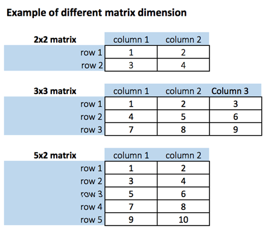

```{r setup, include=FALSE}
knitr::opts_chunk$set(echo = TRUE, fig.align="center")
```

<br>

# What is a Matrix?
***
A matrix is a 2-dimensional array that has m number of rows and n number of columns. In other words, matrix is a combination of two or more vectors with the same data type.

Note: It is possible to create more than two dimensions arrays with R.

<p align="center">

</p>

# How to Create a Matrix in R
***
We can create a matrix with the function`matrix()`. This function takes three arguments:

```
matrix(data, nrow, ncol, byrow = FALSE)
```

__Arguments:__

+ data: The collection of elements that R will arrange into the rows and columns of the matrix
+ nrow: Number of rows 
+ ncol: Number of columns 
+ byrow: The rows are filled from the left to the right. We use `byrow = FALSE` (default values), if we want the matrix to be filled by the columns i.e. the values are filled top to bottom.

Let's construct two 5x2 matrix with a sequence of number from 1 to 10, one with `byrow = TRUE` and one with byrow = FALSE to see the difference.

```{r}
# Construct a matrix with 5 rows that contain the numbers 1 up to 10 and byrow =  TRUE 
matrix_a <- matrix(1:10, byrow = TRUE, nrow = 5)
matrix_a
# Print dimension of the matrix with dim()
dim(matrix_a)
# Construct a matrix with 5 rows that contain the numbers 1 up to 10 and byrow = FALSE
matrix_b <-matrix(1:10, byrow = FALSE, nrow = 5)
matrix_b
# Print dimension of the matrix with dim()
dim(matrix_b)
```

Note: Using command `matrix_b <-matrix(1:10, byrow = FALSE, ncol = 2)` will have same effect as above.

You can also create a 4x3 matrix using ncol. R will create 3 columns and fill the row from top to bottom. Check an example

```{r}
matrix_c <-matrix(1:12, byrow = FALSE, ncol = 3)
matrix_c
```

__Example:__

```{r}
dim(matrix_c)
```

# Add a Column to a Matrix with the cbind() {#buttons .tabset .tabset-fade .tabset-pills}
***
You can add a column to a matrix with the cbind() command. cbind() means column binding. cbind() can concatenate as many matrix or columns as specified. For example, our previous example created a 5x2 matrix. We concatenate a third column and verify the dimension is 5x3

## Example 1:
```{r}
# concatenate c(1:5) to the matrix_a
matrix_a1 <- cbind(matrix_a, c(1:5))
# Check the dimension
dim(matrix_a1)
```

## Example 2:
```{r}
matrix_a1
```

## Example 3:
We can also add more than one column. Let's see the next sequence of number to the matrix_a2 matrix. The dimension of the new matrix will be 4x6 with number from 1 to 24.

```{r}
matrix_a2 <- matrix(13:24, byrow = FALSE, ncol = 3)
```

## Example 4:
```{r}
matrix_c <- matrix(1:12, byrow = FALSE, ncol = 3)		
matrix_d <- cbind(matrix_a2, matrix_c)
dim(matrix_d)
```

__NOTE:__ The number of rows of matrices should be equal for cbind work

cbind() concatenate columns, rbind() appends rows. Let's add one row to our matrix_c matrix and verify the dimension is 5x3

```{r}
matrix_c <- matrix(1:12, byrow = FALSE, ncol = 3)
# Create a vector of 3 columns
add_row <- c(1:3)
# Append to the matrix
matrix_c <- rbind(matrix_c, add_row)
# Check the dimension
dim(matrix_c)
```

# Slice a Matrix
***
We can select elements one or many elements from a matrix by using the square brackets []. This is where slicing comes into the picture.

For example:

+ `matrix_c[1, 2]` selects the element at the first row and second column.
+ `matrix_c[1:3, 2:3]` results in a matrix with the data on the rows 1, 2, 3 and columns 2, 3.
+ `matrix_c[, 1]` selects all elements of the first column.
+ `matrix_c[1, ]` selects all elements of the first row.

Here is the output you get for the above codes

<p align="center">

</p>