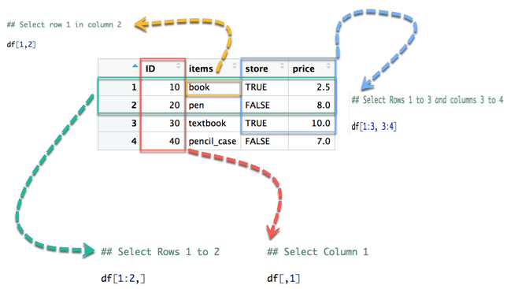

```{r setup, include=FALSE}
knitr::opts_chunk$set(echo = TRUE, fig.align="center")
```

<br>

# What is a Data Frame?
***
A __data frame__ is a list of vectors which are of equal length. A matrix contains only one type of data, while a data frame accepts different data types (numeric, character, factor, etc.).

How to Create a Data Frame
We can create a data frame by passing the variable a,b,c,d into the data.frame() function. We can name the columns with name() and simply specify the name of the variables.

```{r, don-eval, eval=FALSE}
data.frame(df, stringsAsFactors = TRUE)
```

__Arguments:__

+ df: It can be a matrix to convert as a data frame or a collection of variables to join
+ stringsAsFactors: Convert string to factor by default

We can create our first data set by combining four variables of same length.

```{r}
# Create a, b, c, d variables
a <- c(10, 20, 30, 40)
b <- c('book', 'pen', 'textbook', 'pencil_case')
c <- c(TRUE, FALSE, TRUE, FALSE)
d <- c(2.5, 8, 10, 7)
# Join the variables to create a data frame
df <- data.frame(a,b,c,d)
df
```

We can see the column headers have the same name as the variables. We can change the column name with the function names(). Check the example below:

```{r}
# Name the data frame
names(df) <- c('ID', 'items', 'store', 'price')
df
# Print the structure
str(df)
```

__By default, data frame returns string variables as a factor.__

# Slice Data Frame
***
It is possible to SLICE values of a Data Frame. We select the rows and columns to return into bracket precede by the name of the data frame.

A data frame is composed of rows and columns, df[A, B]. A represents the rows and B the columns. We can slice either by specifying the rows and/or columns.

From picture 1, the left part represents the __rows__, and the right part is the __columns__. Note that the symbol `:` means __to__. For instance, `1:3 intends to select values from 1 to 3.

<p align="center">

</p>

In below diagram we display how to access different selection of the data frame:

The yellow arrow selects the __row__ 1 in __column__ 2
The green arrow selects the __rows__ 1 to 2
The red arrow selects the __column__ 1
The blue arrow selects the __rows__ 1 to 3 and __columns__ 3 to 4

Note that, if we let the left part blank, R will select __all the rows__. By analogy, if we let the right part blank, R will select __all the columns__.

<p align="center">

</p>

```{r}
## Select row 1 in column 2
df[1, 2]
## Select Rows 1 to 2
df[1:2, ]
## Select Columns 1
df[, 1]
```

It is also possible to select the columns with their names. For instance, the code below extracts two columns: ID and store.

```{r}
# Slice with columns name
df[, c('ID', 'store')]
```

# Append a Column to Data Frame
***
You can also append a column to a Data Frame. You need to use the symbol $ to append a new variable.

```{r}
# Create a new vector
quantity <- c(10, 35, 40, 5)

# Add `quantity` to the `df` data frame
df$quantity <- quantity
df
```

__Note:__ The number of elements in the vector has to be equal to the no of elements in data frame. Executing the following statement

```{r, error=TRUE}
quantity <- c(10, 35, 40)

# Add `quantity` to the `df` data frame
df$quantity <- quantity
```

# Select a Column of a Data Frame
***
Sometimes, we need to store a column of a data frame for future use or perform operation on a column. We can use the $ sign to select the column from a data frame.

```{r}
# Select the column ID
df$ID
```

# Subset a Data Frame
***
In the previous section, we selected an entire column without condition. It is possible to subset based on whether or not a certain condition was true.

We use the `subset()` function.

```{r, dont-eval, eval=FALSE}
subset(x, condition)
```

__Arguments:__

+ x: data frame used to perform the subset
+ condition: define the conditional statement

We want to return only the items with price above 10, we can do:

```{r}
# Select price above 5
subset(df, subset = price > 5)
```


