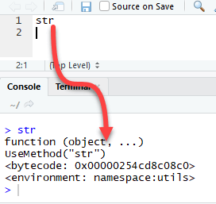
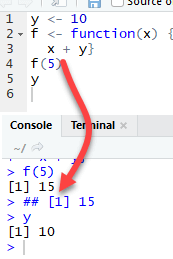
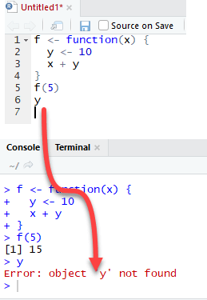

```{r setup, include=FALSE}
knitr::opts_chunk$set(echo = TRUE, fig.align="center")
```

<br>

# What is a Function in R?
***
A function, in a programming environment, is a set of instructions. A programmer builds a function to avoid __repeating__ the same task, or reduce __complexity__.

A function should be

+ written to carry out a specified a tasks
+ may or may not include arguments
+ contain a body
+ may or may not return one or more values.

A general approach to a function is to use the argument part as inputs, feed the body part and finally return an output. The Syntax of a function is the following:

```{r, dont-eval, eval=FALSE}
function (arglist)  {
  #Function body
}
```

# R important built-in functions
***
There are a lot of built-in function in R. R matches your input parameters with its function arguments, either by value or by position, then executes the function body. Function arguments can have default values: if you do not specify these arguments, R will take the default value.

Note: It is possible to see the source code of a function by running the name of the function itself in the console.

<p align="center">

</p>

We will see three groups of function in action
+ General function
+ Maths function
+ Statistical function
+ General functions

We are already familiar with general functions like `cbind(), rbind(), range(), sort(), order()` functions. Each of these functions has a specific task, takes arguments to return an output. Following are important functions one must know

## diff() function
If you work on __time series__, you need to stationary the series by taking their __lag values__. A __stationary process__ allows constant mean, variance and autocorrelation over time. This mainly improves the prediction of a time series. It can be easily done with the function `diff()`. We can build a random time-series data with a trend and then use the function `diff()` to stationary the series. The `diff()` function accepts one argument, a vector, and return suitable lagged and iterated difference.

Note: We often need to create random data, but for learning and comparison we want the numbers to be identical across machines. To ensure we all generate the same data, we use the `set.seed()` function with arbitrary values of 123. The `set.seed()` function is generated through the process of pseudorandom number generator that make every modern computers to have the same sequence of numbers. If we don't use `set.seed()` function, we will all have different sequence of numbers.

```{r}
set.seed(123)
## Create the data
x <- rnorm(1000)
ts <- cumsum(x)
## Stationary the serie
diff_ts <- diff(ts)
par(mfrow = c(1, 2))
## Plot the series
plot(ts, type='l')
plot(diff(ts), type = 'l')
```

## length() function
In many cases, we want to know the length of a vector for computation or to be used in a for loop. The `length()` function counts the number of rows in vector x. The following codes import the cars dataset and return the number of rows.

Note: `length()` returns the number of elements in a vector. If the function is passed into a matrix or a data frame, the number of columns is returned.

```{r}
dt <- datasets::cars
## number columns
length(dt)
## number rows
length(dt[, 1])
```

# Math functions
***
R has an array of mathematical functions.

```{r, echo=FALSE}
library(knitr)
library(kableExtra)
dt2 <- data.frame(
  "Operator" = c("abs(x)", "log(x, base = y)", "exp(x)", "sqrt(x)", "factorial(x)"), 
  "Description" = c("Takes the absolute value of x", "Takes the logarithm of x with base y; if base is not specified, returns the natural logarithm", "Returns the exponential of x", "Returns the square root of x", "Returns the factorial of x (x!)"))
kable(dt2) %>% kable_styling(bootstrap_options = c("striped", "hover"))
```

<!-- | Operator | Description | -->
<!-- |:---------|:------------| -->
<!-- | abs(x) | Takes the absolute value of x | -->
<!-- | log(x, base = y) | Takes the logarithm of x with base y; if base is not specified, returns the natural logarithm | -->
<!-- | exp(x) | Returns the exponential of x | -->
<!-- | sqrt(x) |	Returns the square root of x | -->
<!-- | factorial(x) | Returns the factorial of x (x!)  | -->

```{r}
# sequence of number from 44 to 55 both including incremented by 1
x_vector <- seq(45, 55, by = 1)
#logarithm
log(x_vector)
#exponential
exp(x_vector)
#squared root
sqrt(x_vector)
#factorial
factorial(x_vector)
```

# Statistical functions
***
R standard installation contains wide range of statistical functions. In this tutorial, we will briefly look at the most important function.

__Basic statistic functions__

```{r, echo=FALSE}
library(knitr)
library(kableExtra)
dt2 <- data.frame(
  "Operator" = c("mean(x)", "median(x)", "var(x)", "sd(x)", "scale(x)", "quantile(x)", "summary(x)"), 
  "Description" = c("Mean of x", "Median of x", "Variance of x", "Standard deviation of x", "Standard scores (z-scores) of x", "The quartiles of x", "Summary of x: mean, min, max etc..."))
kable(dt2) %>% kable_styling(bootstrap_options = c("striped", "hover"))
```

| Operator | Description |
|:---------|:------------|
| mean(x) | Mean of x |
| median(x) | Median of x |
| var(x) | Variance of x |
| sd(x) | Standard deviation of x |
| scale(x) | Standard scores (z-scores) of x |
| quantile(x) | The quartiles of x |
| summary(x) | Summary of x: mean, min, max etc... |

```{r}
speed <- dt$speed
speed
# Mean speed of cars dataset
mean(speed)
# Median speed of cars dataset
median(speed)
# Variance speed of cars dataset
var(speed)
# Standard deviation speed of cars dataset
sd(speed)
# Standardize vector speed of cars dataset		
head(scale(speed), 5)
# Quantile speed of cars dataset
quantile(speed)
# Summary speed of cars dataset
summary(speed)
```

Up to this point, we have learned a lot of R built-in functions.

Note: Be careful with the class of the argument, i.e. numeric, Boolean or string. For instance, if we need to pass a string value, we need to enclose the string in quotation mark: "ABC" .

# Write function in R
***
In some occasion, we need to write our own function because we have to accomplish a particular task and no ready made function exists. A user-defined function involves a name, arguments and a body.

```{r, dont-eval2, eval=FALSE}
function.name <- function(arguments) 
{
    computations on the arguments	
    some other code
}
```

Note: A good practice is to name a user-defined function different from a built-in function. It avoids confusion.

## One argument function
In the next snippet, we define a simple square function. The function accepts a value and returns the square of the value.

```{r}
square_function <- function(n) 
{
  # compute the square of integer `n`
  n^2
}  
# calling the function and passing value 4
square_function(4)
```

__Code Explanation:__

+ The function is named square_function; it can be called whatever we want.
+ It receives an argument "n". We didn't specify the type of variable so that the user can pass an integer, a vector or a matrix
+ The function takes the input "n" and returns the square of the input.

When you are done using the function, we can remove it with the `rm()` function.

```{r, error=TRUE}
# after you create the function
rm(square_function)
square_function
```

## Environment Scoping
In R, the __environment__ is a __collection__ of objects like functions, variables, data frame, etc.

R opens an environment each time Rstudio is prompted.

The top-level environment available is the __global environment__, called `R_GlobalEnv`. And we have the __local environment__.

We can list the content of the current environment.

```{r}
ls(environment())
```

The above list will vary for you based on the historic code you execute in R Studio.

Note that n, the argument of the square_function function is __not in this global environment__.

A __new__ environment is created for each function. In the above example, the function `square_function()` creates a new environment inside the global environment.

To clarify the difference between __global__ and __local__ environment, let's study the following example

These function takes a value x as an argument and add it to y define outside and inside the function

<p align="center">

</p>

The function f returns the output 15. This is because y is defined in the global environment. Any variable defined in the global environment can be used locally. The variable y has the value of 10 during all function calls and is accessible at any time.

Let's see what happens if the variable y is defined inside the function.

We need to dropp ``y`` prior to run this code using rm r

<p align="center">

</p>

The output is also 15 when we call `f(5)` but returns an error when we try to print the value y. The variable y is not in the global environment.

Finally, R uses the most recent variable definition to pass inside the body of a function. Let's consider the following example:

<p align="center">

</p>

R ignores the y values defined outside the function because we explicitly created a y variable inside the body of the function.

## Multi arguments function
We can write a function with more than one argument. Consider the function called "times". It is a straightforward function multiplying two variables.

```{r}
times <- function(x, y) {
  x*y
}
times(2, 4)
```

# When should we write function?
***
Data scientist need to do many repetitive tasks. Most of the time, we copy and paste chunks of code repetitively. For example, normalization of a variable is highly recommended before we run a machine learning algorithm. The formula to normalize a variable is:

$$\text{normalize}=\frac{x-x_\text{min}}{x_\text{max}-x_\text{min}}.$$

We already know how to use the min() and max() function in R. We use the tibble library to create the data frame. Tibble is so far the most convenient function to create a data set from scratch.

```{r}
library(tibble)
# Create a data frame
data_frame <- tibble(  
  c1 = rnorm(50, 5, 1.5), 
  c2 = rnorm(50, 5, 1.5),    
  c3 = rnorm(50, 5, 1.5),    
)
```

We will proceed in two steps to compute the function described above. In the first step, we will create a variable called c1_norm which is the rescaling of c1. In step two, we just copy and paste the code of c1_norm and change with c2 and c3.

Detail of the function with the column c1:

+ Nominator: `data_frame$c1 - min(data_frame$c1))`
+ Denominator: `max(data_frame$c1) - min(data_frame$c1))`

Therefore, we can divide them to get the normalized value of column c1:

```{r, dont-eval3, eval=FALSE}
(data_frame$c1 - min(data_frame$c1)) / (max(data_frame$c1) - min(data_frame$c1))	
```

We can create c1_norm, c2_norm and c3_norm:

```{r}
# Create c1_norm: rescaling of c1		
data_frame$c1_norm <- (data_frame$c1 - min(data_frame$c1)) / (max(data_frame$c1) - min(data_frame$c1))
# show the first five values
head(data_frame$c1_norm, 5)
```

It works. We can copy and paste

```{r}
data_frame$c1_norm <- (data_frame$c1 - min(data_frame$c1)) / (max(data_frame$c1) - min(data_frame$c1))
```

then change c1_norm to c2_norm and c1 to c2. We do the same to create c3_norm

```{r}
data_frame$c2_norm <- (data_frame$c2 - min(data_frame$c2)) / (max(data_frame$c2) - min(data_frame$c2))
data_frame$c3_norm <- (data_frame$c3 - min(data_frame$c3)) / (max(data_frame$c3) - min(data_frame$c3))
```

We perfectly rescaled the variables c1, c2 and c3.

However, this method is prone to mistake. We could copy and forget to change the column name after pasting. Therefore, a good practice is to write a function each time you need to paste same code more than twice. We can rearrange the code into a formula and call it whenever it is needed. To write our own function, we need to give:

+ Name: normalize.
+ the number of arguments: We only need one argument, which is the column we use in our computation.
+ The body: this is simply the formula we want to return.

We will proceed step by step to create the function normalize.

__Step 1)__ We create the __nominator__, which is . In R, we can store the nominator in a variable like this:

```{r}
nominator <- x-min(x)
```

__Step 2)__ We compute the __denominator__ . We can replicate the idea of step 1 and store the computation in a variable:

```{r}
denominator <- max(x)-min(x)
```

__Step 3)__ We perform the division between the nominator and denominator.

```{r}
normalize <- nominator/denominator
```

__Step 4)__ To return value to calling function we need to pass normalize inside `return()` to get the output of the function.

```{r, results=FALSE}
return(normalize)
```

__Step 5)__ We are ready to use the function by wrapping everything inside the bracket.

```{r}
normalize <- function(x){
  # step 1: create the nominator
  nominator <- x - min(x)
  # step 2: create the denominator
  denominator <- max(x) - min(x)
  # step 3: divide nominator by denominator
  normalize <- nominator / denominator
  # return the value
  return(normalize)
}
```

Let's test our function with the variable c1:

```{r}
normalize(data_frame$c1)
```

It works perfectly. We created our first function.

Functions are more comprehensive way to perform a repetitive task. We can use the normalize formula over different columns, like below:

```{r}
data_frame$c1_norm_function <- normalize(data_frame$c1)
data_frame$c2_norm_function <- normalize(data_frame$c2)
data_frame$c3_norm_function <- normalize(data_frame$c3)
```

Even though the example is simple, we can infer the power of a formula. The above code is easier to read and especially avoid to mistakes when pasting codes.

# Functions with condition
***
Sometimes, we need to include conditions into a function to allow the code to return different outputs.

In Machine Learning tasks, we need to split the dataset between a train set and a test set. The train set allows the algorithm to learn from the data. In order to test the performance of our model, we can use the test set to return the performance measure. R does not have a function to create two datasets. We can write our own function to do that. Our function takes two arguments and is called `split_data()≠. The idea behind is simple, we multiply the length of dataset (i.e. number of observations) with 0.8. For instance, if we want to split the dataset 80/20, and our dataset contains 100 rows, then our function will multiply 0.8*100 = 80. 80 rows will be selected to become our training data.

We will use the airquality dataset to test our user-defined function. The airquality dataset has 153 rows. We can see it with the code below:

```{r}
nrow(airquality)
```

We will proceed as follow:

```{r, dont-eval4, eval=FALSE}
split_data <- function(df, train = TRUE)
```

__Arguments:__

+ df: Define the dataset
+ train: Specify if the function returns the train set or test set. By default, set to TRUE

Our function has two arguments. The arguments train is a Boolean parameter. If it is set to TRUE, our function creates the train dataset, otherwise, it creates the test dataset.

We can proceed like we did we the `normalise()` function. We write the code as if it was only one-time code and then wrap everything with the condition into the body to create the function.

__Step 1:__
We need to compute the length of the dataset. This is done with the function `nrow()`. Nrow returns the total number of rows in the dataset. We call the variable length.

```{r}
length <- nrow(airquality)
length
```

__Step 2:__
We multiply the length by 0.8. It will return the number of rows to select. It should be 153*0.8 = 122.4

```{r}
total_row <- length * 0.8
total_row
```

We want to select 122 rows among the 153 rows in the airquality dataset. We create a list containing values from 1 to total_row. We store the result in the variable called split

```{r}
split <- 1:total_row
split[1:5] 
```

split chooses the first 122 rows from the dataset. For instance, we can see that our variable split gathers the value 1, 2, 3, 4, 5 and so on. These values will be the index when we will select the rows to return.

__Step 3:__
We need to select the rows in the airquality dataset based on the values stored in the split variable. This is done like this:

```{r}
train_df <- airquality[split, ] 
head(train_df)
```

__Step 4:__
We can create the test dataset by using the remaining rows, 123:153. This is done by using – in front of split.

```{r}
test_df <- airquality[-split, ] 
head(test_df)
```

__Step 5:__
We can create the condition inside the body of the function. Remember, we have an argument train that is a Boolean set to TRUE by default to return the train set. To create the condition, we use the if syntax:

```{r, dont-eval5, eval=FALSE}
if (train == TRUE){ 
  train_df <- airquality[split, ] 
  return(train)		
} else {
  test_df <- airquality[-split, ] 
  return(test)		
}
```

This is it, we can write the function. We only need to change airquality to df because we want to try our function to any data frame, not only airquality:

```{r}
split_data <- function(df, train = TRUE){
  length <- nrow(df)
  total_row <- length * 0.8
  split <- 1:total_row
  if (train == TRUE){ 
    train_df <- df[split, ] 
    return(train_df)		
  } else {
    test_df <- df[-split, ] 
    return(test_df)		
  }
}
```

Let's try our function on the airquality dataset. we should have one train set with 122 rows and a test set with 31 rows.

```{r}
train <- split_data(airquality, train = TRUE)
dim(train)
test <- split_data(airquality, train = FALSE)
dim(test)
```

